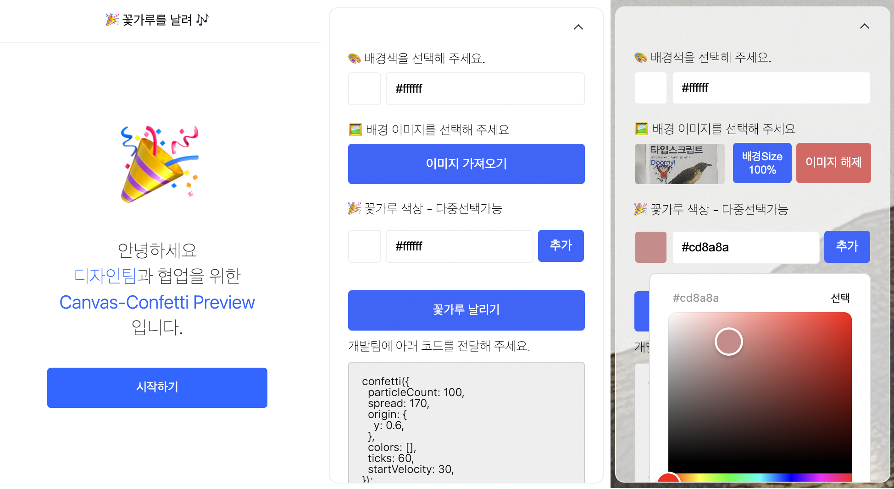

## 🎉 FlyTheFlowers (preview-confetti)

### 🧑‍💻 프로젝트 개요.

- 디자인팀과의 협업을 위한 Canvas-Confetti Preview 페이지 입니다.
- 배경색상과 item의 색상 컬러를 지정하여 색종이 파티클 효과를 미리 구현해보고 디자인에 접목 시킬 수 있습니다.
- 프로모션 랜딩 작업 디자인 시 참고해주세요.

### 🏂 URL.

- [https://flytheflowers.vercel.app](https://flytheflowers.vercel.app)

### 🪬 Keyword.

- `React` `Nextjs` `Typescript` `Recoil` `colorful` `emotion` `immer` `vercel`

### 📺 Owner

<table>
  <tr>
    <td align="center">
      <a href="https://github.com/fe-hyunsu">
      
       
      🎨 Design
       
      김현수
      </a>
    </td>
    <td align="center">
      <a href="https://github.com/fe-hyunsu">
      
       
      🖥 FE
       
      김현수
      </a>
    </td>
  </tr>
</table>
